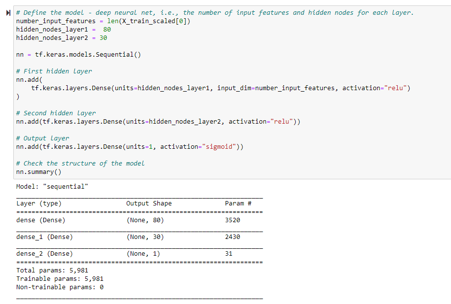
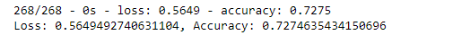

# Neural_Network_Charity_Analysis
Alphabet Soup is a non-profit foundation dedicated to helping organizations that protect the environment, improve people's well-being, and unify the world.
# Overview 
The goal of this analysis is to identify the impact of each donation and ensure that the foundation's money is being used effectively. By using Neural Networks, we can try and determine which organizations are worth donating to and which are too high risk

# Results: 

## Data Preprocessing
- The 'IS_SUCCESSFUL' column is our target feature for this model 
- What variable(s) are considered to be the features for your model?
    - APPLICATION_TYPE
    - AFFILIATION
    - CLASSIFICATION
    - USE_CASE
    - ORGANIZATION
    - STATUS
    - INCOME_AMT
    - SPECIAL_CONSIDERATIONS
    - ASK_AMT
- Variables which are neither targets nor features, were removed from the input data:
    - EIN
    - NAME
## Compiling, Training, and Evaluating the Model
- How many neurons, layers, and activation functions did you select for your neural network model, and why?
    - 80 neurons were used in the first layer
    - 30 neurons used in the second layer
    - Relu was used to simplify our output in each layer
    - the Sigmoid Function was the output activation function as the outcome is a binary classification of either the charity was successful or not due to the foundation's provided donation
    ### Figure 1 - Neurons/Layers/Activation functions used:
    </img>
    
- Were you able to achieve the target model performance?
    - The target model performance of 75% was not achieved, after attempts at optimization only a maximum performance of 72.7% was observed
    ### Figure 2 - Optimization result:
    </img>

- What steps did you take to try and increase model performance?
    - attempts involved:
    1. Adding an additional layer with 30 neurons
    2. Using Leaky ReLu as an activation function for the first input layer and a hidden layer
    3. Additional 2 layers with 20 and 10 neurons respectively and having a softmax output
    4. Additional 2 layers with 20 and 10 neurons respectively with sigmoid output
# Summary: 
With optimization, the model is able to produce a model with 72.7% accuracy on whether we can determine if a charity/organization will be successful. While it did not achieve the targeted goal of 75%, with this model Alphabet Soup can decide with better accuracy on which charity/organization to donate to which will ultimately achieve success.

Instead of using a Deep Learning Neural Network, another model that could be used is a Support Vector Machine. Since we are attempting to find a binary classified outcome and we have labeled data with outcomes, we could use Supervised Learning to create a more accurate model.